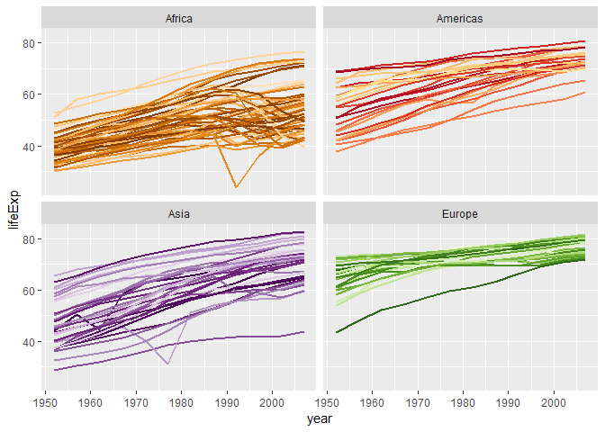
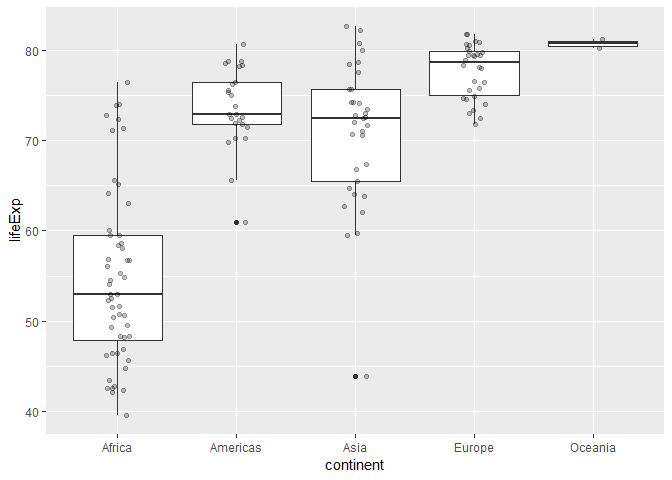
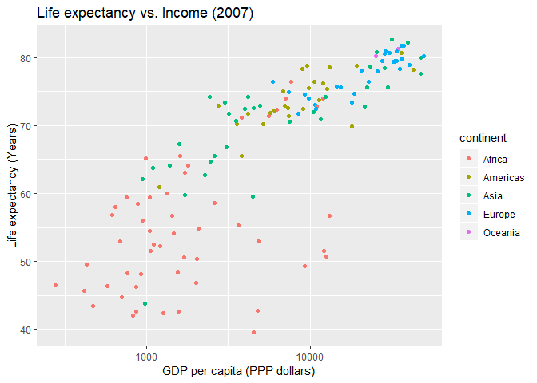
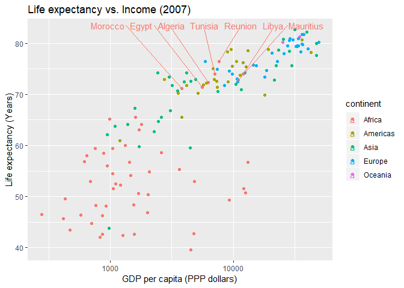
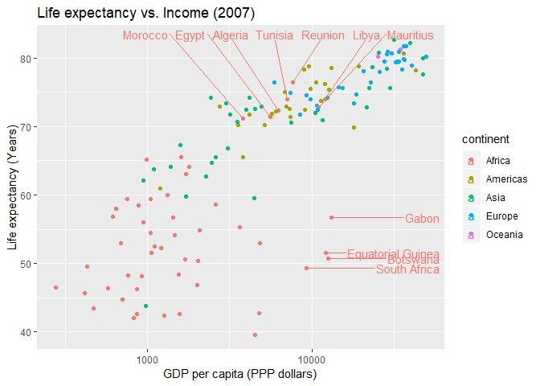

hw01\_gapminder
================
@RetoSterchi
September 15, 2018

Load data
---------

Let's load the *gapminder* data set for our exploration purposes

``` r
library("gapminder")
```

    ## Warning: package 'gapminder' was built under R version 3.4.4

Let's have a look a the data set structure
------------------------------------------

Let's have a look a the structure of the dataset

``` r
str(gapminder)
```

    ## Classes 'tbl_df', 'tbl' and 'data.frame':    1704 obs. of  6 variables:
    ##  $ country  : Factor w/ 142 levels "Afghanistan",..: 1 1 1 1 1 1 1 1 1 1 ...
    ##  $ continent: Factor w/ 5 levels "Africa","Americas",..: 3 3 3 3 3 3 3 3 3 3 ...
    ##  $ year     : int  1952 1957 1962 1967 1972 1977 1982 1987 1992 1997 ...
    ##  $ lifeExp  : num  28.8 30.3 32 34 36.1 ...
    ##  $ pop      : int  8425333 9240934 10267083 11537966 13079460 14880372 12881816 13867957 16317921 22227415 ...
    ##  $ gdpPercap: num  779 821 853 836 740 ...

We have a data frame with

-   1704 observations and
-   6 variables:
    -   *country* is a factor with 142 levels
    -   *continent* is a factor with 5 levels
    -   *year* spans the period from 1952 to 2007 in increments of 5 years
    -   *pop* is the population per country and year
    -   *gdpPercap* GDP per capita
    -   *lifeExp* is the life expectancy in years

We can also get at the range of the values by getting a summary of the data set:

``` r
summary(gapminder)
```

    ##         country        continent        year         lifeExp     
    ##  Afghanistan:  12   Africa  :624   Min.   :1952   Min.   :23.60  
    ##  Albania    :  12   Americas:300   1st Qu.:1966   1st Qu.:48.20  
    ##  Algeria    :  12   Asia    :396   Median :1980   Median :60.71  
    ##  Angola     :  12   Europe  :360   Mean   :1980   Mean   :59.47  
    ##  Argentina  :  12   Oceania : 24   3rd Qu.:1993   3rd Qu.:70.85  
    ##  Australia  :  12                  Max.   :2007   Max.   :82.60  
    ##  (Other)    :1632                                                
    ##       pop              gdpPercap       
    ##  Min.   :6.001e+04   Min.   :   241.2  
    ##  1st Qu.:2.794e+06   1st Qu.:  1202.1  
    ##  Median :7.024e+06   Median :  3531.8  
    ##  Mean   :2.960e+07   Mean   :  7215.3  
    ##  3rd Qu.:1.959e+07   3rd Qu.:  9325.5  
    ##  Max.   :1.319e+09   Max.   :113523.1  
    ## 

See <https://www.gapminder.org/data/documentation/> for a in-depth description of the data.

Let's do some basic data exploration
------------------------------------

What countries are categorized as *Oceania*?

``` r
unique(gapminder$country[gapminder$continent=="Oceania"])
```

    ## [1] Australia   New Zealand
    ## 142 Levels: Afghanistan Albania Algeria Angola Argentina ... Zimbabwe

What is the median life expectancy at birth for the different continents?

``` r
require(dplyr)
```

    ## Loading required package: dplyr

    ## 
    ## Attaching package: 'dplyr'

    ## The following objects are masked from 'package:stats':
    ## 
    ##     filter, lag

    ## The following objects are masked from 'package:base':
    ## 
    ##     intersect, setdiff, setequal, union

``` r
gapminder %>%
    filter(year == 2007) %>%
    group_by(continent) %>%
    summarise(lifeExp = median(lifeExp))
```

    ## # A tibble: 5 x 2
    ##   continent lifeExp
    ##   <fct>       <dbl>
    ## 1 Africa       52.9
    ## 2 Americas     72.9
    ## 3 Asia         72.4
    ## 4 Europe       78.6
    ## 5 Oceania      80.7

What are the ten countries with the lowest or highest life expectancy? Let's only consider the most recent data from the year 2007.

``` r
gapminder %>% 
    filter(year == 2007) %>%
    mutate(ranking = rank(desc(lifeExp), ties.method = 'first')) %>% 
    arrange(desc(ranking))
```

    ## # A tibble: 142 x 7
    ##    country               continent  year lifeExp     pop gdpPercap ranking
    ##    <fct>                 <fct>     <int>   <dbl>   <int>     <dbl>   <int>
    ##  1 Swaziland             Africa     2007    39.6  1.13e6     4513.     142
    ##  2 Mozambique            Africa     2007    42.1  2.00e7      824.     141
    ##  3 Zambia                Africa     2007    42.4  1.17e7     1271.     140
    ##  4 Sierra Leone          Africa     2007    42.6  6.14e6      863.     139
    ##  5 Lesotho               Africa     2007    42.6  2.01e6     1569.     138
    ##  6 Angola                Africa     2007    42.7  1.24e7     4797.     137
    ##  7 Zimbabwe              Africa     2007    43.5  1.23e7      470.     136
    ##  8 Afghanistan           Asia       2007    43.8  3.19e7      975.     135
    ##  9 Central African Repu~ Africa     2007    44.7  4.37e6      706.     134
    ## 10 Liberia               Africa     2007    45.7  3.19e6      415.     133
    ## # ... with 132 more rows

``` r
gapminder %>% 
    filter(year == 2007) %>%
    mutate(ranking = rank(desc(lifeExp), ties.method = 'first')) %>% 
    arrange(ranking)
```

    ## # A tibble: 142 x 7
    ##    country          continent  year lifeExp       pop gdpPercap ranking
    ##    <fct>            <fct>     <int>   <dbl>     <int>     <dbl>   <int>
    ##  1 Japan            Asia       2007    82.6 127467972    31656.       1
    ##  2 Hong Kong, China Asia       2007    82.2   6980412    39725.       2
    ##  3 Iceland          Europe     2007    81.8    301931    36181.       3
    ##  4 Switzerland      Europe     2007    81.7   7554661    37506.       4
    ##  5 Australia        Oceania    2007    81.2  20434176    34435.       5
    ##  6 Spain            Europe     2007    80.9  40448191    28821.       6
    ##  7 Sweden           Europe     2007    80.9   9031088    33860.       7
    ##  8 Israel           Asia       2007    80.7   6426679    25523.       8
    ##  9 France           Europe     2007    80.7  61083916    30470.       9
    ## 10 Canada           Americas   2007    80.7  33390141    36319.      10
    ## # ... with 132 more rows

Let's include a basic plot in our RMarkdown script
--------------------------------------------------

RMarkdown allows us to not only include chunks of R code and console output but also graphs. For instance, we could embed a very simple and not very informative plot directly in a RMarkdown file:


Note: When the parameter `echo = FALSE` is added to the code chunk the R code that generated the plot will not be printed. This might come in handy when generating a report of an analysis but usually we want to be able to follow the code more easily and might want to include the R code chunk in the printout (i.e., the default echo=TRUE).

Let's make some more informative plots
--------------------------------------

First, let's plot the development of life expectancy for every country in the dataset (excluding Oceania which only consists of New Zealand and Australia as we saw earlier). Let's group the plots by continent.

``` r
require(ggplot2)
```

    ## Loading required package: ggplot2

    ## Warning: package 'ggplot2' was built under R version 3.4.4

``` r
ggplot(subset(gapminder, continent != "Oceania"),
       aes(x = year, y = lifeExp, group = country, color = country)) +
  geom_line(lwd = 1, show.legend = FALSE) + 
  facet_wrap(~ continent) +
  scale_color_manual(values = country_colors) +
  theme(strip.text = element_text(size = rel(1.1)))
```



Let's have a closer look at the distribution of the life expectancy values for the different continents:

``` r
gapminder %>% 
    filter(year == 2007) %>%
    ggplot(aes(x = continent, y = lifeExp)) +
      geom_boxplot() +
      geom_jitter(position = position_jitter(width = 0.1, height = 0), alpha = 1/4)
```



Which are these countries in Africa with the highest life expectancy between 70 and 80? Let's do the query with dplyr first:

``` r
## version using dplyr
gapminder %>% 
    filter(year == 2007) %>%
    filter(continent=="Africa") %>% 
    mutate(ranking = rank(desc(lifeExp), ties.method = 'first')) %>% 
    arrange(ranking) %>% 
    filter(lifeExp > 70)
```

    ## # A tibble: 7 x 7
    ##   country   continent  year lifeExp      pop gdpPercap ranking
    ##   <fct>     <fct>     <int>   <dbl>    <int>     <dbl>   <int>
    ## 1 Reunion   Africa     2007    76.4   798094     7670.       1
    ## 2 Libya     Africa     2007    74.0  6036914    12057.       2
    ## 3 Tunisia   Africa     2007    73.9 10276158     7093.       3
    ## 4 Mauritius Africa     2007    72.8  1250882    10957.       4
    ## 5 Algeria   Africa     2007    72.3 33333216     6223.       5
    ## 6 Egypt     Africa     2007    71.3 80264543     5581.       6
    ## 7 Morocco   Africa     2007    71.2 33757175     3820.       7

Let's do the same query using base R:

``` r
## version using base R

q <- gapminder[gapminder$year == 2007 & gapminder$continent == "Africa", ]
q <- q[rev(order(q$lifeExp)),]
q <- q[q$lifeExp > 70,]
q
```

    ## # A tibble: 7 x 6
    ##   country   continent  year lifeExp      pop gdpPercap
    ##   <fct>     <fct>     <int>   <dbl>    <int>     <dbl>
    ## 1 Reunion   Africa     2007    76.4   798094     7670.
    ## 2 Libya     Africa     2007    74.0  6036914    12057.
    ## 3 Tunisia   Africa     2007    73.9 10276158     7093.
    ## 4 Mauritius Africa     2007    72.8  1250882    10957.
    ## 5 Algeria   Africa     2007    72.3 33333216     6223.
    ## 6 Egypt     Africa     2007    71.3 80264543     5581.
    ## 7 Morocco   Africa     2007    71.2 33757175     3820.

Now, let's make a basic plot that shows the world's population between the 1952 and 2007 to see where the biggest increase in population happened.

``` r
gapminder %>% 
  group_by(year, continent) %>% 
  summarise(popTotal=sum(as.numeric(pop)) / 1000000000) %>% 
  ggplot(aes(x=year,y=popTotal,group=continent,fill=continent)) +
  geom_area() +
  xlab("Year") +
  ylab("Population (billions)") +
  ggtitle("Population") + 
  scale_fill_discrete(name="Continent")
```


And finally let's see if we can do something with the life expectancy data. Maybe let's plot it against the GPD per capita of individual countries for the most recent year in the dataset.

``` r
gapminder %>%
  filter(year == 2007) %>% 
  ggplot(aes(x=gdpPercap, y=lifeExp, group=country, colour=continent)) +
  geom_point() +
  xlab("GDP per capita (PPP dollars)") +
  ylab("Life expectancy (Years)") +
  ggtitle("Life expectancy vs. Income (2007)") +
  scale_fill_discrete(name="Continent") +
  scale_x_log10()
```



Looks like there is some sort of relationship between these two parameters what makes sense if we consider what potentialy influences life expectancy (quality of sanitary facilities, child fatality, access to medical services etc.)

Let's find the seven countries in Africa with the highest life expectancy again and identify them on the graph. A Google search leads us to the *ggrepel* package that can nicely deal with labels on ggplot graphs. Let's install and load it.

``` r
# install.packages("ggrepel")
require(ggrepel)
```

    ## Loading required package: ggrepel

    ## Warning: package 'ggrepel' was built under R version 3.4.4

We can find many examples of how to use the package describe under <https://cran.r-project.org/web/packages/ggrepel/vignettes/ggrepel.html>.

Using the *ggrepel* package let's only add the labels for those seven countries on the top of the graph.

``` r
gapminder %>%
  filter(year == 2007) %>% 
  ggplot(aes(x=gdpPercap, y=lifeExp, group=country, colour=continent, label=country)) +
  geom_point() +
  geom_text_repel(data = subset(gapminder, year == 2007 & country %in% c("Reunion", "Libya", "Tunisia", "Mauritius", "Algeria", "Egypt", "Morocco")),
                  nudge_y = 90 - subset(gapminder, year == 2007 & country %in% c("Reunion", "Libya", "Tunisia", "Mauritius", "Algeria", "Egypt", "Morocco"))$lifeExp) +
  xlab("GDP per capita (PPP dollars)") +
  ylab("Life expectancy (Years)") +
  ggtitle("Life expectancy vs. Income (2007)") +
  scale_fill_discrete(name="Continent") +
  scale_x_log10()
```



That seems to provide further support for our suspected relationship between life expectancy and GDP. However, there are a handful of African countries with similar GDP but way lower life expectancies. Just to round things up, let's add the names of these countries to the plot as well.

``` r
gapminder %>%
  filter(year == 2007) %>% 
  ggplot(aes(x=gdpPercap, y=lifeExp, group=country, colour=continent, label=country)) +
  geom_point() +
  geom_text_repel(data = subset(gapminder, year == 2007 & country %in% c("Reunion", "Libya", "Tunisia", "Mauritius", "Algeria", "Egypt", "Morocco")),
                  nudge_y = 90 - subset(gapminder, year == 2007 & country %in% c("Reunion", "Libya", "Tunisia", "Mauritius", "Algeria", "Egypt", "Morocco"))$lifeExp) +
  geom_text_repel(data = subset(gapminder, year == 2007 & continent == "Africa" & gdpPercap > 9000 & lifeExp < 60),
                  nudge_x = 14000 - subset(gapminder, year == 2007 & continent == "Africa" & gdpPercap > 9000 & lifeExp < 60)$gdpPercap) +
  xlab("GDP per capita (PPP dollars)") +
  ylab("Life expectancy (Years)") +
  ggtitle("Life expectancy vs. Income (2007)") +
  scale_fill_discrete(name="Continent") +
  scale_x_log10()
```


